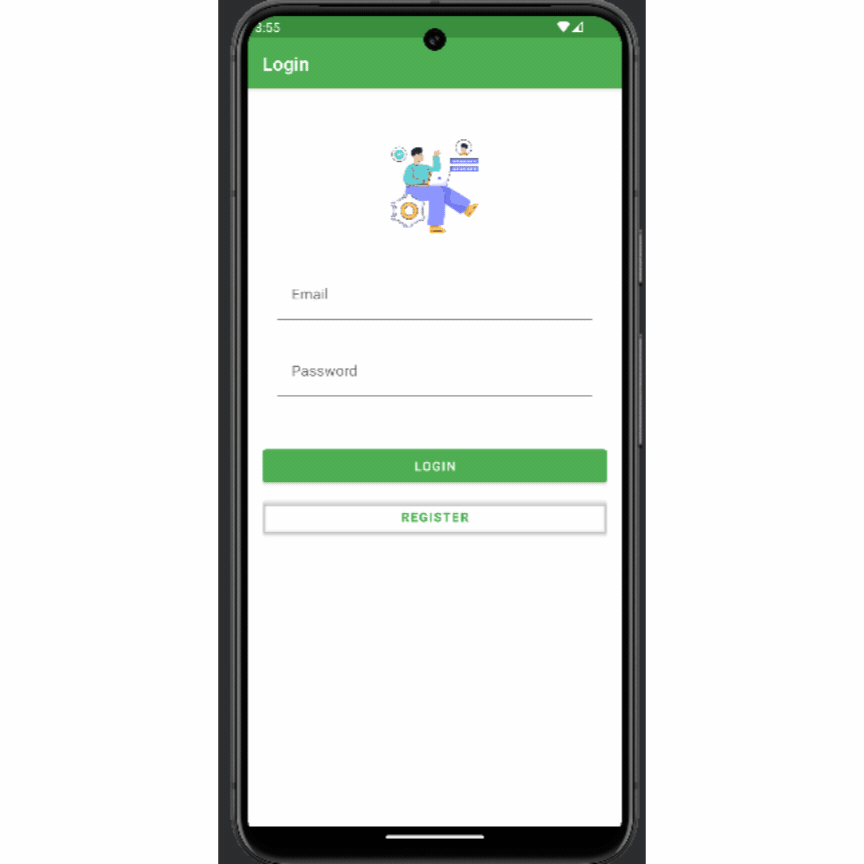

# Crud Categories

Este proyecto de Android es un sistema CRUD para la gestión de categorías con integración para obtener y mostrar datos de una API externa. La aplicación está construida siguiendo la arquitectura MVVM (Model-View-ViewModel) y utiliza varias bibliotecas y prácticas modernas de desarrollo de Android.

## Características

- **Operaciones CRUD**: Crear, Leer, Actualizar, Eliminar categorías.
- **Integración con API de Pokémon**: Obtener y mostrar detalles de Pokémon utilizando [PokeAPI](https://pokeapi.co/).
- **Autenticación con Firebase**: El sistema de autenticación de usuarios está realizado utilizando Firebase, garantizando seguridad y facilidad de uso.
- **Inyección de Dependencias**: Implementada usando Koin.
- **Comunicación de Red**: Manejo de llamadas a la API mediante Retrofit.
- **View Binding**: Simplifica la referencia a las vistas en actividades y fragmentos.

## Arquitectura

La aplicación está organizada en las siguientes capas:

- **Capa de UI**: Actividades y Fragmentos para la interacción del usuario.
- **Capa de ViewModel**: Gestiona los datos relacionados con la interfaz de usuario y la lógica de negocio.
- **Capa de Repositorio**: Maneja las operaciones de datos, ya sea desde la red o almacenamiento local.
- **Capa de Red (API)**: Responsable de las llamadas a la API utilizando Retrofit.
- **Capa de Inyección de Dependencias**: Proporciona dependencias a los componentes de la aplicación usando Koin.

  ## Descripción de los principales componentes:

- **app/src/main/java/com/phidalgo/crudcategories**: Este es el paquete principal que contiene todas las clases y paquetes relacionados con la funcionalidad del proyecto.

  - **ui**: Contiene las actividades y fragmentos relacionados con la interfaz de usuario (UI).
    - **auth**: Módulo para manejar la autenticación de usuarios, incluyendo el login y registro.
    - **main**: Actividad principal de la aplicación.
    - **pokemon**: Incluye fragmentos y adaptadores relacionados con la visualización de datos de Pokémon.
  
  - **model**: Define las clases de datos, como `Category`, `Pokemon`, y las respuestas de la API (`PokemonDetailResponse`, `PokemonResponse`).
  
  - **di**: Contiene los módulos de inyección de dependencias, definidos con Koin.
  
  - **data/network**: Incluye las clases responsables de la comunicación con APIs externas, organizadas por función (e.g., `AuthRepository`, `PokemonService`).
  
  - **util**: Contiene clases utilitarias para manejar tareas comunes, como la gestión de imágenes (`GlideUtils`) y el teclado (`KeyboardUtils`).

- **app/src/main/AndroidManifest.xml**: Archivo de manifiesto que define la estructura y las configuraciones principales de la aplicación.

## Instalación

Para configurar el proyecto en tu máquina local, sigue estos pasos:

1. **Clona el repositorio**:
   ```bash
   git clone https://github.com/PaulHidalgo/CrudCategories.git
   cd CrudCategories
   ```

2. **Abre el proyecto en Android Studio**:
   - Abre Android Studio y selecciona "Open an existing Android Studio project".
   - Navega al directorio `CrudCategories` y haz clic en "Open".

3. **Sincroniza el proyecto con los archivos de Gradle**:
   - Una vez abierto el proyecto, Android Studio te pedirá sincronizar los archivos de Gradle. Permite que la sincronización se complete.

4. **Agrega la Configuración de Firebase**:
   - Coloca tu archivo `google-services.json` en el directorio `app/`. Este archivo es necesario para la autenticación con Firebase.

5. **Compila y Ejecuta el proyecto**:
   - Selecciona tu dispositivo/emulador de destino y haz clic en "Run" en Android Studio.

## Uso

- **Autenticación con Firebase**: Regístrate o inicia sesión utilizando las pantallas de autenticación proporcionadas. La autenticación está completamente integrada con Firebase para ofrecer una experiencia segura.
- **Gestión de Categorías**: Crea nuevas categorías, visualiza las existentes, edítalas o elimínalas.
- **Búsqueda de Pokémon**: Utiliza la búsqueda integrada para encontrar Pokémon y ver sus detalles.

## Dependencias

- **Koin**: Framework de inyección de dependencias.
- **Retrofit**: Cliente HTTP para solicitudes de API.
- **Firebase**: Servicios de autenticación y nube.
- **View Binding**: Simplifica la vinculación de componentes de UI en código.


## Vista previa de aplicación


  
## Descarga apk
- Se puede descargar el apk para instalarse en su dispositivo.
[Descargar APK](https://github.com/PaulHidalgo/crud_categories/blob/main/app-debug.apk)

## Contribuir

Si deseas contribuir a este proyecto, por favor, haz un fork del repositorio y utiliza una rama de características. Las solicitudes de pull son bienvenidas.

## Licencia

Este proyecto está licenciado bajo la Licencia MIT - consulta el archivo [LICENSE](LICENSE) para más detalles.
